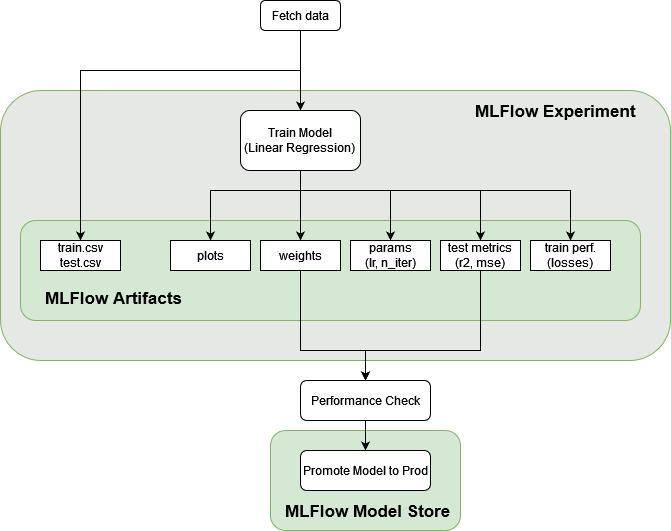
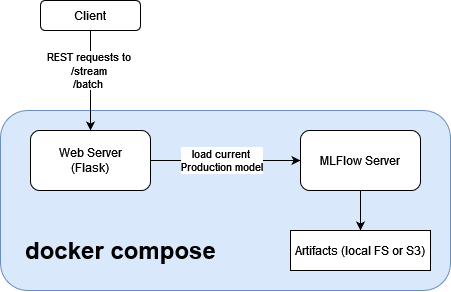
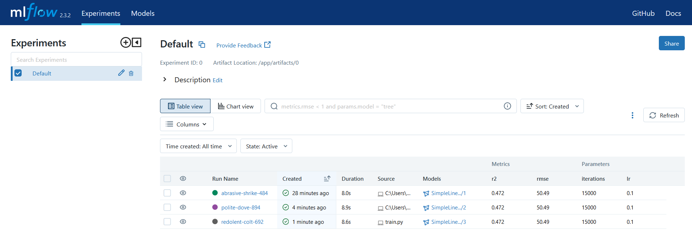
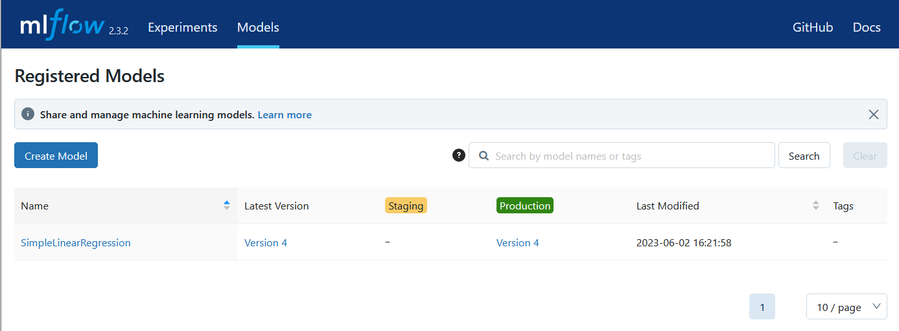

# Endeavour: ML End-to-End

## System Design

* Training observability is ensured through experiment tracking using MLFlow
* Training can be triggered either manually (developers running code locally) or by CI pipeline
* The model is served by a custom flask server instead of relying on `mlflow serve`, to ensure that
  1. appropriate security could easily be added to the project if this service was to face the public internet
  2. we can adhere to the required API specification (`/stream` and `/batch`)
* Notable simplifications
  * No load balancer when serving the model
  * No k8s deployment. We push images to Github's registry in CI though, which facilitates deployment to k8s
  * No model staging (we promote directly to prod if performance checks pass); we would usually set a model to staging, test its performance by serving a small fraction of clients (1%) using a load balancer, which we'd gradually increase (5%, 10% etc). Once we are sure there are no problems (performance regressions, crashes, systems overloads etc..) we'd promote to prod.
  * Artifacts are stored on the local FS. We'd usually set up a remote MLFlow server with artifacts stored in s3


### Training Pipeline


### Inference


## Running locally (docker)

Build the project images:
```bash
docker-compose build
```

Run tests (includes detection of linting issues)
```bash
docker-compose run test
```

### Run inference
Start stack (flask server has autoreload)
```bash
docker-compose up web -d
```
You can verify that the stack is running by checking the status of the flask server on `http://localhost:8000/health`, 
while the mlflow server is on `http://localhost:5000/`.

You can also verify that the stack is working correctly by requesting a prediction
```python
import requests

# test /stream
X_request = {'X': 0.2}
r = requests.post("http://localhost:8000/stream", json=X_request)
print(r.json())

# test /batch
X_request = {'X': [0.2, 0.5, -0.1]}
r = requests.post("http://localhost:8000/batch", json=X_request)
print(r.json())
```

### Run training
While the stack is running (we need MLFlow up to log models and metrics), training can be run as follows
```bash
docker-compose run train
```
a new model will be trained and if performance checks pass, the model will be promoted to production:

Model Registry:



## Running locally (no docker)

it is recommended to work with the docker setup above. However, it is possible to install this project as an editable 
package for quick local iterations:
```bash
pip install -e .
```


## ToDos

Phase I:

1. General fixes
- [x] fix code so that training works
- [x] stores weights in ./artifacts/<date>.csv file
- [x] tests: that SGD converges properly on known data
- [x] fix dependencies
- [x] __init__ is missing docstring
- [x] some docstrings aren't correct; generate_data() says it's from a normal distrib
- [x] signatures missing everywhere
2. dockerized operation for **training** 
- [x] training is executable as a docker container
3. model serving
- [x] create flask app
- [x] load csv/pickle, serve predictions /stream, /batch
- [x] check model predictions work for /stream, document how to make a POST request in README
- [x] make flask app runnable as a docker container
4. CI
- [x] make project pip installable
- [x] add github actions CI pipeline [run tests; build image]
 
Phase II: MLFlow

- [x] training stores params, scores and artifacts (train/test sets, and plots) using mlflow
- [x] store model and create simple logic to upgrade it to production on training success
- [ ] flask model loads current production model if ml server reachable; some local weights if not
- [x] add mlflow model server to docker-compose
